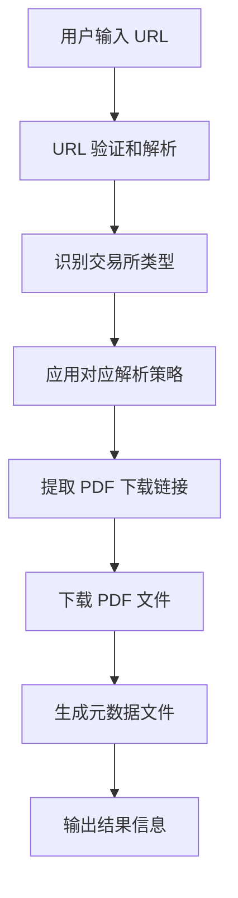

# 产品规格说明书：IPO Prospectus Fetcher CLI 工具

## 1. 产品概述

IPO Prospectus Fetcher（`ipofetch`）是一个轻量级 Python CLI 工具，用于从招股说明书网页 URL 自动下载 PDF 文件。该工具支持中国大陆（巨潮）、香港（HKEXnews）、美国（SEC EDGAR）三大交易所的公开页面，为内部研究及未来 Agentic 系统提供可靠、可编程的数据获取能力。

## 2. 核心特性

### 2.1 用户角色
本工具为单用户命令行工具，无需用户注册或权限管理。

### 2.2 功能模块

我们的 CLI 工具包含以下主要功能：

1. **命令行界面**：提供用户友好的 CLI 命令和参数处理
2. **URL 解析模块**：自动识别和解析不同交易所的网页结构
3. **PDF 下载模块**：处理 PDF 文件的下载和本地保存
4. **元数据管理**：生成和管理下载文件的元数据信息
5. **Python API 接口**：提供编程接口供其他系统调用

### 2.3 页面详情

| 功能模块 | 核心组件 | 功能描述 |
|----------|----------|----------|
| 命令行界面 | 参数解析器 | 处理 --url、--output、--verbose 等命令行参数 |
| 命令行界面 | 帮助系统 | 提供详细的使用说明和错误提示 |
| URL 解析模块 | 通用解析器 | 基于 httpx + lxml 的通用 PDF 链接提取 |
| URL 解析模块 | 交易所适配器 | 针对巨潮、HKEXnews、SEC EDGAR 的特定解析逻辑 |
| PDF 下载模块 | 文件下载器 | 支持断点续传和重试机制的 PDF 下载 |
| PDF 下载模块 | 文件管理器 | 处理文件命名、目录创建和文件验证 |
| 元数据管理 | JSON 生成器 | 生成包含 URL、下载时间、文件哈希的元数据 |
| Python API | 核心函数 | 提供 download_prospectus_from_url() 编程接口 |

## 3. 核心流程

用户通过命令行提供招股说明书页面 URL，工具自动解析页面结构，识别 PDF 下载链接，下载文件到本地目录，并生成相应的元数据文件。

## 4. 用户界面设计

### 4.1 设计风格

- **主要颜色**：终端默认色彩方案，使用 rich 库提供的彩色输出
- **输出风格**：简洁的命令行界面，支持进度条和状态提示
- **字体**：系统默认等宽字体
- **布局风格**：垂直布局的命令行输出，支持详细和简洁两种模式
- **图标样式**：使用 Unicode 字符和 emoji 提供视觉反馈

### 4.2 界面设计概览

| 界面组件 | 模块名称 | UI 元素 |
|----------|----------|---------|
| 命令行界面 | 主命令 | 彩色的命令提示符，支持 --help 参数显示详细帮助 |
| 命令行界面 | 进度显示 | 使用 rich 库的进度条显示下载进度 |
| 命令行界面 | 状态输出 | 彩色的成功/错误/警告信息，支持 --verbose 详细模式 |
| 命令行界面 | 结果展示 | 表格形式显示下载结果，包含文件路径、大小、耗时等信息 |

### 4.3 响应性

该工具为命令行应用，主要在桌面环境使用，支持各种终端窗口大小的自适应显示。