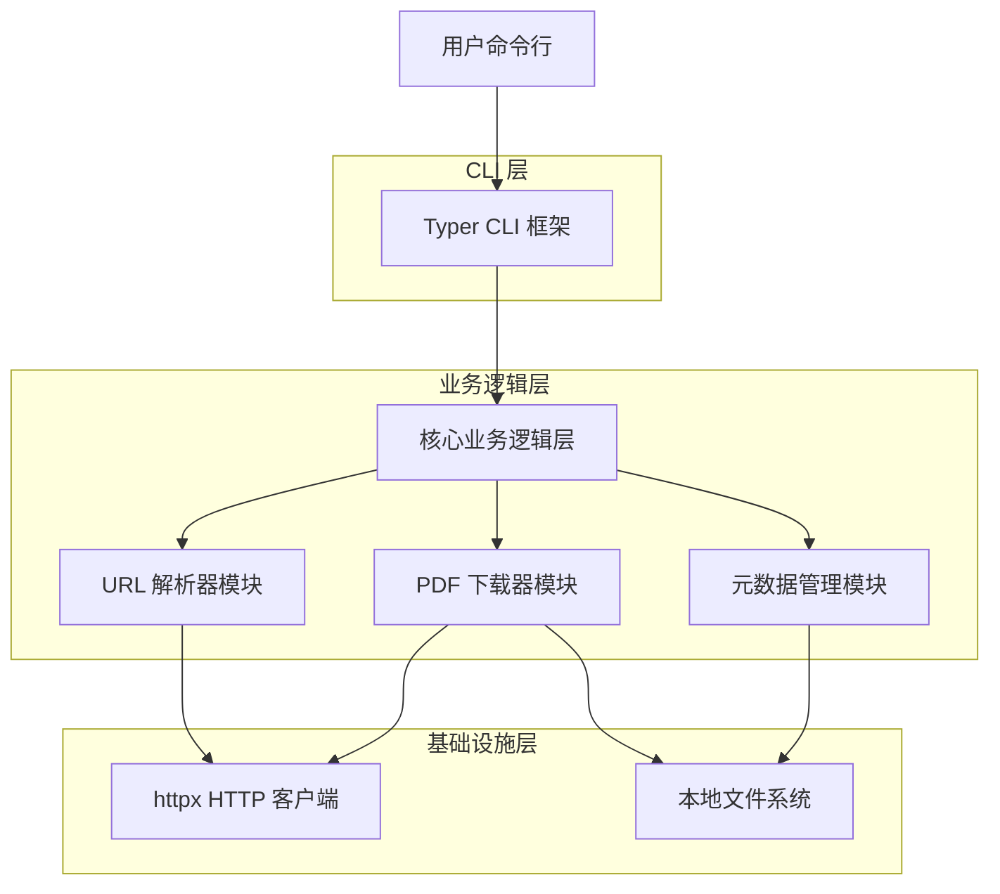
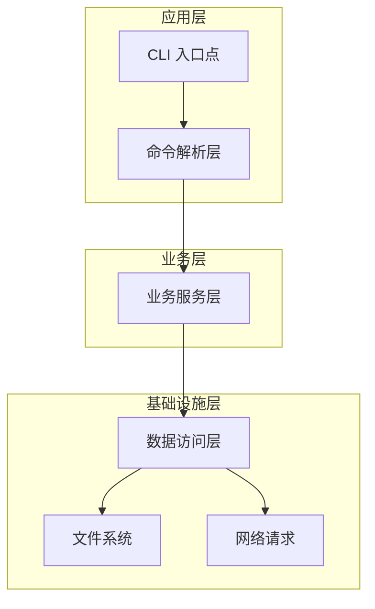
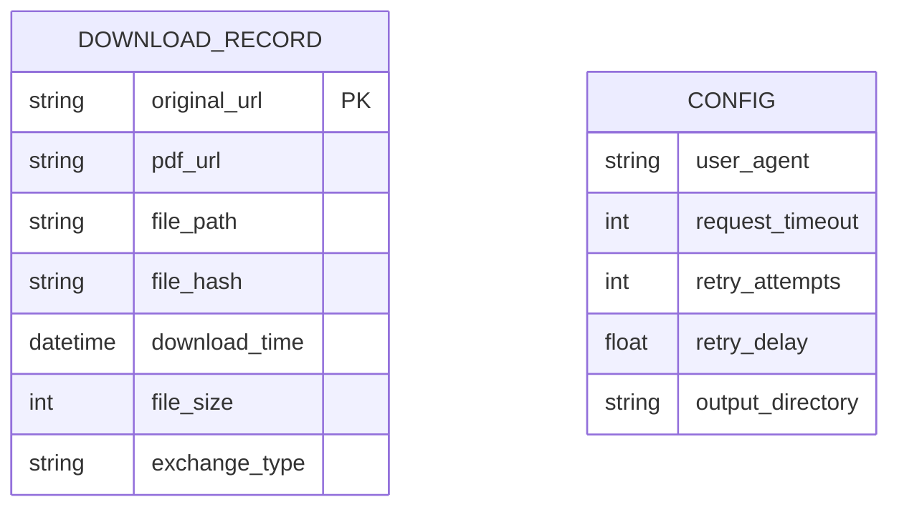

# 技术架构文档：IPO Prospectus Fetcher CLI 工具

## 1. 架构设计



## 2. 技术描述

- 前端：Typer@0.9.0 + Rich@13.0.0（CLI 界面和终端美化）
- 后端：Python 3.8+ 核心逻辑
- HTTP 客户端：httpx@0.25.0（支持异步和同步请求）
- HTML 解析：lxml（高性能 XML/HTML 解析）
- 配置管理：pydantic-settings@2.0.0（类型安全的配置处理）

## 3. 路由定义

| 命令 | 用途 |
|------|------|
| `ipofetch --url <URL>` | 主命令，从指定 URL 下载招股说明书 PDF |
| `ipofetch --help` | 显示帮助信息和使用说明 |
| `ipofetch --version` | 显示工具版本信息 |
| `ipofetch --url <URL> --output <DIR>` | 指定输出目录下载 PDF |
| `ipofetch --url <URL> --verbose` | 启用详细输出模式 |

## 4. API 定义

### 4.1 核心 API

Python 编程接口

```python
def download_prospectus_from_url(url: str, output_dir: str = "./prospectus/") -> Dict[str, Any]
```

参数:
| 参数名称 | 参数类型 | 是否必需 | 描述 |
|----------|----------|----------|------|
| url | str | true | 招股说明书页面的完整 URL |
| output_dir | str | false | 输出目录路径，默认为 "./prospectus/" |

返回值:
| 参数名称 | 参数类型 | 描述 |
|----------|----------|------|
| success | bool | 下载是否成功 |
| pdf_path | str | 下载的 PDF 文件路径 |
| metadata_path | str | 生成的元数据文件路径 |
| file_size | int | PDF 文件大小（字节） |
| download_time | float | 下载耗时（秒） |

示例:
```json
{
  "success": true,
  "pdf_path": "./prospectus/company_prospectus_20241201.pdf",
  "metadata_path": "./prospectus/company_prospectus_20241201.json",
  "file_size": 2048576,
  "download_time": 3.45
}
```

### 4.2 内部模块 API

URL 解析器接口
```python
def extract_pdf_links(url: str, html_content: str) -> List[str]
```

PDF 下载器接口
```python
def download_pdf(pdf_url: str, output_path: str) -> bool
```

元数据生成器接口
```python
def generate_metadata(original_url: str, pdf_url: str, file_path: str) -> Dict[str, Any]
```

## 5. 服务器架构图



## 6. 数据模型

### 6.1 数据模型定义



### 6.2 数据定义语言

元数据 JSON 结构
```json
{
  "original_url": "https://example.com/prospectus-page",
  "pdf_url": "https://example.com/prospectus.pdf",
  "file_path": "./prospectus/company_prospectus_20241201.pdf",
  "file_hash": "sha256:abc123...",
  "download_time": "2024-12-01T10:30:00Z",
  "file_size": 2048576,
  "exchange_type": "cninfo",
  "tool_version": "1.0.0"
}
```

配置文件结构（可选）
```json
{
  "user_agent": "IPOFetch/1.0.0",
  "request_timeout": 30,
  "retry_attempts": 3,
  "retry_delay": 1.0,
  "output_directory": "./prospectus/",
  "verbose": false
}
```

交易所适配器配置
```json
{
  "cninfo": {
    "base_url": "http://www.cninfo.com.cn",
    "pdf_selectors": ["a[href$='.pdf']"],
    "keywords": ["招股说明书", "prospectus"]
  },
  "hkexnews": {
    "base_url": "https://www1.hkexnews.hk",
    "pdf_selectors": ["a[href*='.pdf']"],
    "keywords": ["prospectus", "招股章程"]
  },
  "sec_edgar": {
    "base_url": "https://www.sec.gov",
    "pdf_selectors": ["a[href*='.htm']"],
    "keywords": ["prospectus", "S-1", "F-1"]
  }
}
```