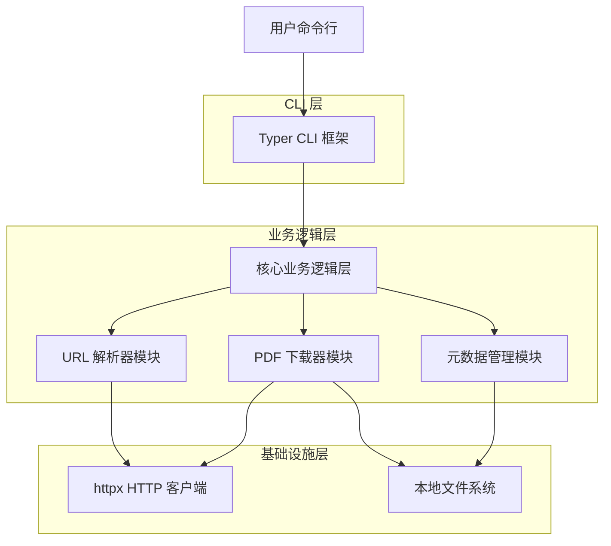
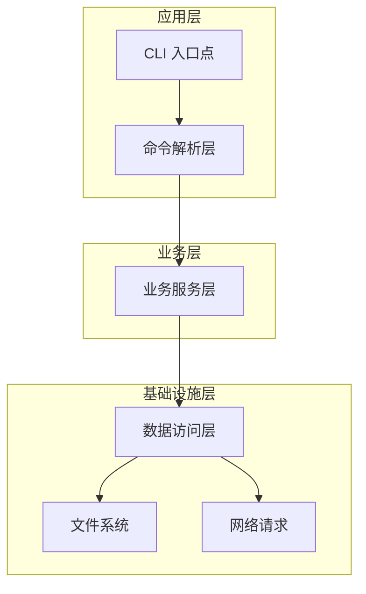
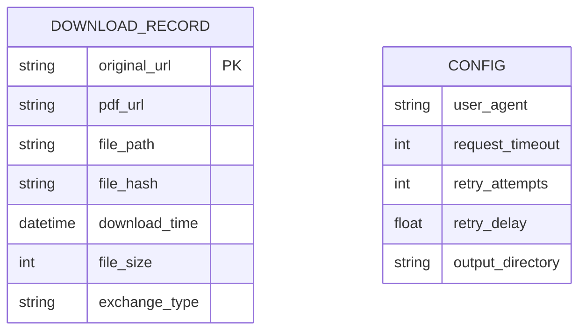
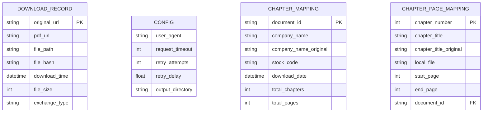

# 技术架构文档：IPO Prospectus Fetcher CLI 工具

## 1. 架构设计



## 2. 技术栈

- **前端界面**：Typer@0.9.0 + Rich@13.0.0（CLI 界面和终端美化）
- **核心逻辑**：Python 3.8+ 兼容
- **HTTP 客户端**：httpx@0.25.0（支持异步和同步请求）
- **HTML 解析**：lxml@4.9.0（高性能 XML/HTML 解析）
- **配置管理**：pydantic-settings@2.0.0（类型安全的配置处理）
- **代码质量**：Ruff（linting + formatting）+ MyPy（类型检查）

## 3. 代码质量保证

### 3.1 静态分析工具

- **Ruff**: 超快速 Python linter 和 formatter
  - 替代 flake8, isort, black 等多个工具
  - 配置文件：`ruff.toml`
  - 支持 70+ 规则集，包括安全检查、复杂度控制
  
- **MyPy**: 静态类型检查
  - 严格模式配置
  - 强制类型注解覆盖

- **Pytest**: 测试框架
  - 单元测试和集成测试
  - 代码覆盖率报告

### 3.2 代码规范

- **行长度**: 88 字符（Black 兼容）
- **Python 版本**: 3.8+ 兼容性要求
- **类型提示**: 所有公共函数必须有类型注解
- **文档字符串**: Google 风格文档字符串
- **导入风格**: 单行导入，按字母顺序排序
- **复杂度限制**: McCabe 复杂度不超过 10

## 4. 命令行接口

| 命令 | 用途 |
|------|------|
| `ipofetch <URL>` | 主命令，从指定 URL 下载招股说明书 PDF |
| `ipofetch --help` | 显示帮助信息和使用说明 |
| `ipofetch --version` | 显示工具版本信息 |
| `ipofetch <URL> --output <DIR>` | 指定输出目录下载 PDF |
| `ipofetch <URL> --verbose` | 启用详细输出模式 |

## 5. API 定义

### 5.1 核心 API

Python 编程接口

```python
def download_prospectus_from_url(url: str, output_dir: str = "./prospectus/") -> Dict[str, Any]
```

参数:
| 参数名称 | 参数类型 | 是否必需 | 描述 |
|----------|----------|----------|------|
| url | str | true | 招股说明书页面的完整 URL |
| output_dir | str | false | 输出目录路径，默认为 "./prospectus/" |

返回值:
| 参数名称 | 参数类型 | 描述 |
|----------|----------|------|
| success | bool | 下载是否成功 |
| pdf_path | str | 下载的 PDF 文件路径 |
| metadata_path | str | 生成的元数据文件路径 |
| file_size | int | PDF 文件大小（字节） |
| download_time | float | 下载耗时（秒） |

示例:
```json
{
  "success": true,
  "pdf_path": "./prospectus/company_prospectus_20241201.pdf",
  "metadata_path": "./prospectus/company_prospectus_20241201.json",
  "file_size": 2048576,
  "download_time": 3.45
}
```

### 5.2 内部模块 API

URL 解析器接口
```python
def extract_pdf_links(url: str, html_content: str) -> List[str]
```

PDF 下载器接口
```python
def download_pdf(pdf_url: str, output_path: str) -> bool
```

元数据生成器接口
```python
def generate_metadata(original_url: str, pdf_url: str, file_path: str) -> Dict[str, Any]
```

## 6. 项目结构

```
src/ipofetch/
├── __init__.py              # 包初始化和公共 API
├── __main__.py              # 模块入口点 (python -m ipofetch)
├── main.py                  # CLI 入口点 (Typer)
├── types.py                 # 类型定义和数据模型
├── core/                    # 核心业务逻辑
│   ├── __init__.py
│   ├── api.py               # 通用 API 函数
│   └── hkex_api.py          # 香港交易所专用 API
├── parsers/                 # URL 解析器
│   ├── __init__.py
│   ├── base.py              # 基础解析器接口
│   ├── cninfo.py            # 中国（巨潮）解析器
│   ├── hkexnews.py          # 香港交易所解析器
│   └── sec_edgar.py         # 美国 SEC EDGAR 解析器
├── downloader/              # PDF 下载功能
│   ├── __init__.py
│   ├── pdf_downloader.py    # 通用 PDF 下载器
│   └── hkex_downloader.py   # 香港交易所专用下载器
├── metadata/                # 元数据生成和管理
│   ├── __init__.py
│   ├── generator.py         # 通用元数据生成器
│   ├── hkex_generator.py    # 香港交易所元数据生成器
│   └── hkex_schema.json     # HKEX数据结构模式
├── mapping/                 # 章节映射功能（新模块）
│   ├── __init__.py
│   ├── chapter_mapper.py    # 章节页码映射器
│   ├── page_calculator.py   # 页码计算器
│   └── hkex_mapping.py      # HKEX专用映射生成器
└── config/                  # 配置管理
    ├── __init__.py
    └── settings.py          # 应用设置和环境变量
```

## 7. 服务器架构图



## 8. 数据模型

### 8.1 数据模型定义



### 8.2 数据定义语言

元数据 JSON 结构
```json
{
  "original_url": "https://example.com/prospectus-page",
  "pdf_url": "https://example.com/prospectus.pdf",
  "file_path": "./prospectus/company_prospectus_20241201.pdf",
  "file_hash": "sha256:abc123...",
  "download_time": "2024-12-01T10:30:00Z",
  "file_size": 2048576,
  "exchange_type": "cninfo",
  "tool_version": "1.0.0"
}
```

配置文件结构（可选）
```json
{
  "user_agent": "IPOFetch/1.0.0",
  "request_timeout": 30,
  "retry_attempts": 3,
  "retry_delay": 1.0,
  "output_directory": "./prospectus/",
  "verbose": false
}
```

交易所适配器配置
```json
{
  "cninfo": {
    "base_url": "http://www.cninfo.com.cn",
    "pdf_selectors": ["a[href$='.pdf']"],
    "keywords": ["招股说明书", "prospectus"]
  },
  "hkexnews": {
    "base_url": "https://www1.hkexnews.hk",
    "pdf_selectors": ["a[href*='.pdf']"],
    "keywords": ["prospectus", "招股章程"]
  },
  "sec_edgar": {
    "base_url": "https://www.sec.gov",
    "pdf_selectors": ["a[href*='.htm']"],
    "keywords": ["prospectus", "S-1", "F-1"]
  }
}
```

### 4.1 核心 API

Python 编程接口

```python
def download_prospectus_from_url(url: str, output_dir: str = "./prospectus/") -> Dict[str, Any]
```

参数:
| 参数名称 | 参数类型 | 是否必需 | 描述 |
|----------|----------|----------|------|
| url | str | true | 招股说明书页面的完整 URL |
| output_dir | str | false | 输出目录路径，默认为 "./prospectus/" |

返回值:
| 参数名称 | 参数类型 | 描述 |
|----------|----------|------|
| success | bool | 下载是否成功 |
| pdf_path | str | 下载的 PDF 文件路径 |
| metadata_path | str | 生成的元数据文件路径 |
| file_size | int | PDF 文件大小（字节） |
| download_time | float | 下载耗时（秒） |

示例:
```json
{
  "success": true,
  "pdf_path": "./prospectus/company_prospectus_20241201.pdf",
  "metadata_path": "./prospectus/company_prospectus_20241201.json",
  "file_size": 2048576,
  "download_time": 3.45
}
```

### 4.2 内部模块 API

URL 解析器接口
```python
def extract_pdf_links(url: str, html_content: str) -> List[str]
```

PDF 下载器接口
```python
def download_pdf(pdf_url: str, output_path: str) -> bool
```

元数据生成器接口
```python
def generate_metadata(original_url: str, pdf_url: str, file_path: str) -> Dict[str, Any]
```

## 5. 服务器架构图


## 6. 数据模型

### 6.1 数据模型定义



### 6.2 数据定义语言

元数据 JSON 结构
```json
{
  "original_url": "https://example.com/prospectus-page",
  "pdf_url": "https://example.com/prospectus.pdf",
  "file_path": "./prospectus/company_prospectus_20241201.pdf",
  "file_hash": "sha256:abc123...",
  "download_time": "2024-12-01T10:30:00Z",
  "file_size": 2048576,
  "exchange_type": "cninfo",
  "tool_version": "1.0.0"
}
```

HKEX章节映射文件结构
```json
{
  "document_info": {
    "company_name": "Example Company Limited",
    "company_name_original": "示例有限公司",
    "document_id": "2024120112345",
    "stock_code": "01234",
    "download_date": "2024-12-01T10:30:00Z",
    "total_chapters": 15,
    "total_pages": 256,
    "tool_version": "1.0.0"
  },
  "chapter_mapping": [
    {
      "chapter_number": 1,
      "chapter_title": "Cover",
      "chapter_title_original": "封面",
      "local_file": "01234-Example_Company_Limited-01-封面-20241201123000UTC.pdf",
      "page_range": {
        "start_page": 1,
        "end_page": 2,
        "page_count": 2
      },
      "file_size": 65536,
      "pdf_url": "https://www1.hkexnews.hk/listedco/listconews/.../chapter1.pdf"
    }
  ]
}
```

配置文件结构（可选）
```json
{
  "user_agent": "IPOFetch/1.0.0",
  "request_timeout": 30,
  "retry_attempts": 3,
  "retry_delay": 1.0,
  "output_directory": "./prospectus/",
  "verbose": false
}
```

交易所适配器配置
```json
{
  "cninfo": {
    "base_url": "http://www.cninfo.com.cn",
    "pdf_selectors": ["a[href$='.pdf']"],
    "keywords": ["招股说明书", "prospectus"]
  },
  "hkexnews": {
    "base_url": "https://www1.hkexnews.hk",
    "pdf_selectors": ["a[href*='.pdf']"],
    "keywords": ["prospectus", "招股章程"]
  },
  "sec_edgar": {
    "base_url": "https://www.sec.gov",
    "pdf_selectors": ["a[href*='.htm']"],
    "keywords": ["prospectus", "S-1", "F-1"]
  }
}
```